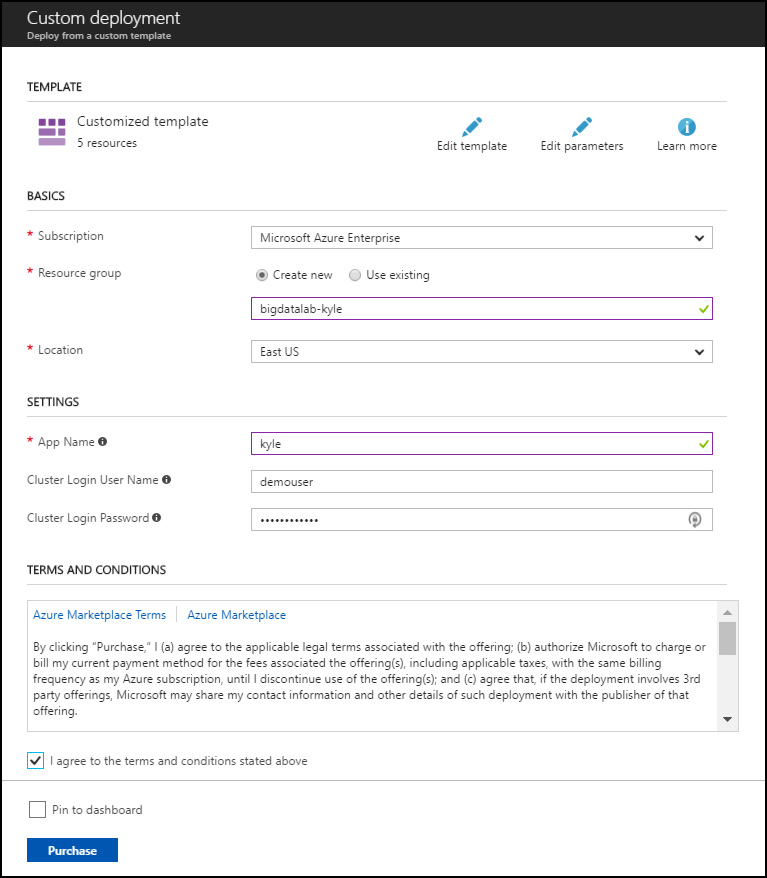
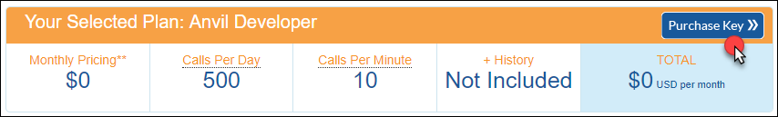
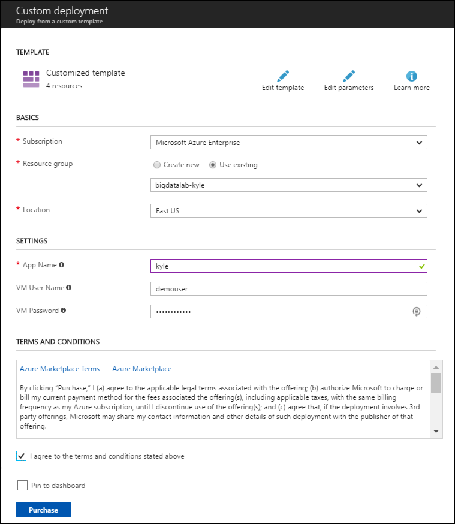
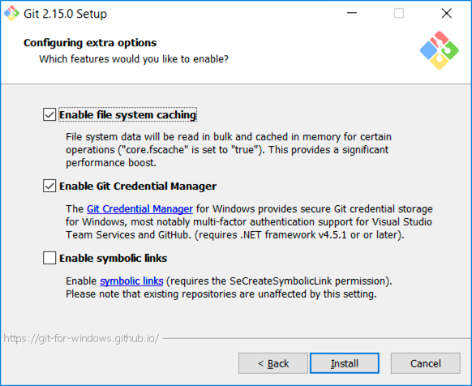

<div class="MCWHeader1">
Big data and visualization
</div>

<div class="MCWHeader2">
Hands-on lab unguided
</div>

<div class="MCWHeader3">
April 2018
</div>


Information in this document, including URL and other Internet Web site references, is subject to change without notice. Unless otherwise noted, the example companies, organizations, products, domain names, e-mail addresses, logos, people, places, and events depicted herein are fictitious, and no association with any real company, organization, product, domain name, e-mail address, logo, person, place or event is intended or should be inferred. Complying with all applicable copyright laws is the responsibility of the user. Without limiting the rights under copyright, no part of this document may be reproduced, stored in or introduced into a retrieval system, or transmitted in any form or by any means (electronic, mechanical, photocopying, recording, or otherwise), or for any purpose, without the express written permission of Microsoft Corporation.

Microsoft may have patents, patent applications, trademarks, copyrights, or other intellectual property rights covering subject matter in this document. Except as expressly provided in any written license agreement from Microsoft, the furnishing of this document does not give you any license to these patents, trademarks, copyrights, or other intellectual property.

The names of manufacturers, products, or URLs are provided for informational purposes only and Microsoft makes no representations and warranties, either expressed, implied, or statutory, regarding these manufacturers or the use of the products with any Microsoft technologies. The inclusion of a manufacturer or product does not imply endorsement of Microsoft of the manufacturer or product. Links may be provided to third party sites. Such sites are not under the control of Microsoft and Microsoft is not responsible for the contents of any linked site or any link contained in a linked site, or any changes or updates to such sites. Microsoft is not responsible for webcasting or any other form of transmission received from any linked site. Microsoft is providing these links to you only as a convenience, and the inclusion of any link does not imply endorsement of Microsoft of the site or the products contained therein.
© 2018 Microsoft Corporation. All rights reserved.

Microsoft and the trademarks listed at https://www.microsoft.com/en-us/legal/intellectualproperty/Trademarks/Usage/General.aspx are trademarks of the Microsoft group of companies. All other trademarks are property of their respective owners.

**Contents**

<!-- TOC -->

- [Big data and visualization hands-on lab unguided](#big-data-and-visualization-hands-on-lab-unguided)
    - [Abstract and learning objectives](#abstract-and-learning-objectives)
    - [Overview](#overview)
    - [Solution architecture](#solution-architecture)
    - [Requirements](#requirements)
    - [Before the hands-on lab](#before-the-hands-on-lab)
        - [Task 1: Deploy HDInsight cluster, Azure ML, and Storage Accounts to Azure](#task-1-deploy-hdinsight-cluster-azure-ml-and-storage-accounts-to-azure)
        - [Task 2: Register for a trial API account at WeatherUnderground.com](#task-2-register-for-a-trial-api-account-at-weatherundergroundcom)
        - [Task 3: Deploy Lab Virtual Machine (Lab VM) to Azure](#task-3-deploy-lab-virtual-machine-lab-vm-to-azure)
        - [Task 4: Install Power BI Desktop on the Lab VM](#task-4-install-power-bi-desktop-on-the-lab-vm)
        - [Task 5: Install an SSH client](#task-5-install-an-ssh-client)
    - [Exercise 1: Build a Machine Learning Model](#exercise-1-build-a-machine-learning-model)
        - [Task 1: Navigate to Machine Learning Studio](#task-1-navigate-to-machine-learning-studio)
        - [Task 2: Upload the sample datasets](#task-2-upload-the-sample-datasets)
        - [Task 3: Start a new experiment](#task-3-start-a-new-experiment)
        - [Task 4: Prepare flight delay data](#task-4-prepare-flight-delay-data)
        - [Task 5: Prepare the weather data](#task-5-prepare-the-weather-data)
        - [Task 6: Join the flight and weather datasets](#task-6-join-the-flight-and-weather-datasets)
        - [Task 7: Train the model](#task-7-train-the-model)
        - [Task 8: Operationalize the experiment](#task-8-operationalize-the-experiment)
    - [Exercise 2: Setup Azure Data Factory](#exercise-2-setup-azure-data-factory)
        - [Task 1: Connect to the Lab VM](#task-1-connect-to-the-lab-vm)
        - [Task 2: Download and stage data to be processed](#task-2-download-and-stage-data-to-be-processed)
        - [Task 3: Install and configure Azure Data Factory Integration Runtime on the lab VM](#task-3-install-and-configure-azure-data-factory-integration-runtime-on-the-lab-vm)
        - [Task 4: Create an Azure data factory](#task-4-create-an-azure-data-factory)
    - [Exercise 3: Develop a data factory pipeline for data movement](#exercise-3-develop-a-data-factory-pipeline-for-data-movement)
        - [Task 1: Create copy pipeline using the Copy Data Wizard](#task-1-create-copy-pipeline-using-the-copy-data-wizard)
    - [Exercise 4: Operationalize ML scoring with Azure ML and Data Factory](#exercise-4-operationalize-ml-scoring-with-azure-ml-and-data-factory)
        - [Task 1: Create Azure ML Linked Service](#task-1-create-azure-ml-linked-service)
        - [Task 2: Create Azure ML input dataset](#task-2-create-azure-ml-input-dataset)
        - [Task 3: Create Azure ML scored dataset](#task-3-create-azure-ml-scored-dataset)
        - [Task 4: Create Azure ML predictive pipeline](#task-4-create-azure-ml-predictive-pipeline)
        - [Task 5: Monitor pipeline activities](#task-5-monitor-pipeline-activities)
    - [Exercise 5: Summarize data using HDInsight Spark](#exercise-5-summarize-data-using-hdinsight-spark)
        - [Task 1: Install pandas on the HDInsight cluster](#task-1-install-pandas-on-the-hdinsight-cluster)
        - [Task 2: Summarize delays by airport](#task-2-summarize-delays-by-airport)
    - [Exercise 6: Visualizing in Power BI Desktop](#exercise-6-visualizing-in-power-bi-desktop)
        - [Task 1: Connect to the Lab VM](#task-1-connect-to-the-lab-vm-1)
        - [Task 2: Connect to HDInsight Spark using Power BI Desktop](#task-2-connect-to-hdinsight-spark-using-power-bi-desktop)
        - [Task 3: Create Power BI report](#task-3-create-power-bi-report)
    - [Exercise 7: Deploy intelligent web app](#exercise-7-deploy-intelligent-web-app)
        - [Task 1: Deploy web app from GitHub](#task-1-deploy-web-app-from-github)
    - [After the hands-on lab](#after-the-hands-on-lab)
        - [Task 1: Delete resource group](#task-1-delete-resource-group)

<!-- /TOC -->


# Big data and visualization hands-on lab unguided 

## Abstract and learning objectives 

In this workshop, you will deploy a web app using Machine Learning (ML) to predict travel delays given flight delay data and weather conditions. Plan a bulk data import operation, followed by preparation, such as cleaning and manipulating the data for testing, and training your Machine Learning model.

By attending this workshop, you will be better able to build a complete Azure Machine Learning (ML) model for predicting if an upcoming flight will experience delays. In addition, you will learn to:

-   Integrate the Azure ML web service in a Web App for both one at a time and batch predictions

-   Use Azure Data Factory (ADF) for data movement and operationalizing ML scoring

-   Summarize data with HDInsight and Spark SQL

-   Visualize batch predictions on a map using Power BI

This hands-on lab is designed to provide exposure to many of Microsoft's transformative line of business applications built using Microsoft big data and advanced analytics. The goal is to show an end-to-end solution, leveraging many of these technologies, but not necessarily doing work in every component possible. The lab architecture is below and includes:

-   Azure Machine Learning (Azure ML)

-   Azure Data Factory (ADF)

-   Azure Storage

-   HDInsight Spark

-   Power BI Desktop

-   Azure App Service

## Overview

AdventureWorks Travel (AWT) provides concierge services for business travelers. In an increasingly crowded market, they are always looking for ways to differentiate themselves, and provide added value to their corporate customers.

They are looking to pilot a web app that their internal customer service agents can use to provide additional information useful to the traveler during the flight booking process. They want to enable their agents to enter in the flight information and produce a prediction as to whether the departing flight will encounter a 15-minute or longer delay, considering the weather forecasted for the departure hour.

In this hands-on lab, attendees will build an end-to-end solution to predict flight delays, accounting for the weather forecast.

## Solution architecture

Below is a diagram of the solution architecture you will build in this lab. Please study this carefully so you understand the whole of the solution as you are working on the various components.

![The Solution Architecture diagram begins with Lab VM, then flows to Data Factory File Copy Pipeline, which flows to Storage for copied, raw file. This flows to Data Factory Batch Scoring pipeline, which includes Deployed ML Predictive Model (Batch). The pipeline flows to Storage for scored data, which flows to Spark for data processing. Power BI Report reads data from Spark, then sends the data on to Flight Booking Web App. Deployed ML Predictive Model (Request/Response) real-time scoring also sends data to the Flight Booking Web App, which then flows to the End User.](images/Hands-onlabunguided-Bigdataandvisualizationimages/media/image2.png "Solution Architecture diagram")

The solution begins with loading their historical data into blob storage using Azure Data Factory (ADF). By setting up a pipeline containing a copy activity configured to copy time partitioned source data, they could pull all their historical information, as well as ingest any future data, into Azure blob storage through a scheduled, and continuously running pipeline. Because their historical data is stored on-premises, AWT would need to install and configure an Azure Data Factory Integration Runtime (formerly known as a Data Management Gateway). Azure Machine Learning (Azure ML) would be used to develop a two-class classification machine learning model, which would then be operationalized as a Predictive Web Service using ML Studio. After operationalizing the ML model, a second ADF pipeline, using a Linked Service pointing to Azure ML's Batch Execution API and an AzureMLBatchExecution activity, would be used to apply the operational model to data as it is moved to the proper location in Azure storage. The scored data in Azure storage can be explored and prepared using Spark SQL on HDInsight, and the results visualized using a map visualization in Power BI.

## Requirements

1.  Microsoft Azure subscription must be pay-as-you-go or MSDN

    a.  Trial subscriptions will not work

## Before the hands-on lab

Duration: 45 minutes

In this exercise, you will set up your environment for use in the rest of the hands-on lab. You should follow all the steps provided in the Before the Hands-on Lab section to prepare your environment *before* attending the hands-on lab.

### Task 1: Deploy HDInsight cluster, Azure ML, and Storage Accounts to Azure

1.  CTRL+Click the **Deploy to Azure** button below, and you will be taken to the Azure portal, and presented with a form for a new custom deployment (which uses an Azure Resource Management (ARM) template from a GitHub repository). You will be presented with a blade to provide some custom parameters as show in the screenshot below.

    

2.  In the Custom deployment blade that appears, enter the following values:

    a.  Subscription: Select your subscription

    b.  Resource group: Use and existing Resource group, or create a new one by entering a unique name, such as "**bigdatalab-\[your intials or first name\]**".

    c.  Location: Select a location for the Resource group. Recommend using East US, East US 2, West Central US, or West US 2, as some resources, such as Data Factory, are only available in those regions.

    d.  App name: Enter a unique name, such as your initials or first name. This value must be between 3 and 10 characters long, and should not contain any special characters. Note the name, as you will need to use it in your Lab VM deployment in Task 3 as well.

    e.  Cluster Login User Name: Enter a name, or accept the default. Note all references to this in the lab use the default user name, **demouser**, so if you change it, please note it for future reference throughout the lab.

    f.  Cluster Login Password: Enter a password, or accept the default. Note all references to this in the lab use the default password, **Password.1!!**, so if you change it, please note it for future reference throughout the lab.

    g.  Check the box to agree to the terms.

    h.  Select **Purchase**. 
    
    

3.  The deployment will take about 15 minutes to complete.

4.  Wait for the deployment to complete before attempting to deploy the Lab Virtual Machine in Task 3, as it depends on the Virtual Network created by this deployment. In the meantime, you can move on to the next task, Task 2, while this deployment is ongoing.

### Task 2: Register for a trial API account at WeatherUnderground.com

To retrieve the 10-day hourly weather forecast, you will use an API from WeatherUnderground.com. There is a free developer version that provides you access to the API you need for this hands-on lab.

1.  Navigate to <https://www.wunderground.com/signup>.

2.  Complete the Create an Account form by providing your email address and a password, and agreeing to the terms. Select Sign up for free.

    

3.  Navigate to <https://www.wunderground.com/login>.

4.  Once logged into Weather Underground navigate to <http://www.wunderground.com/weather/api/>.

5.  Select **Explore My Options**.

    

6.  On the Get Your API Key page, select **Anvil Plan**. 

    

7.  Scroll down until you see the area titled How much will you use our service? Ensure **Developer** is selected. 

    

8.  Select **Purchase Key**.

    

9.  Complete the brief contact form. For Project Name and Project Web use the input **MCW** (Microsoft Cloud Workshop). When answering where will the API be used, select **Website**. For Will the API be used for commercial use and Will the API be used for manufacturing mobile chip processing, select **No**. Select **Purchase Key**.

    

10.  You should be taken to a page that displays your key, like the following. Take note of your API Key. It is available from the text box labeled **Key ID**.


11. To verify that your API Key is working, modify the following URL to include your API Key: 

    [http://api.wunderground.com/api/\<YOURAPIKEY\>/hourly10day/q/SEATAC.json](http://api.wunderground.com/api/%3cYOURAPIKEY%3e/hourly10day/q/SEATAC.json)

12. Open your modified link in a browser, you should get a JSON result showing the 10-day, hourly weather forecast for the Seattle-Tacoma International Airport.

    

### Task 3: Deploy Lab Virtual Machine (Lab VM) to Azure

1.  CTRL+Click the **Deploy to Azure** button below, and you will be taken to the Azure portal, and presented with a form for a new custom deployment (which uses an ARM template from a GitHub repository). You will be presented with a blade to provide some custom parameters as show in the screenshot below. 

    

2.  In the Custom deployment blade that appears, enter the following values:

    a.  Subscription: Select your subscription

    b.  Resource group: Choose Use Existing, and select the same resource group you used when deploying your HDInsight cluster and Azure ML workspace, above.

    c.  Location: The location should be automatically selected to be the same as your Resource Group.

    d.  App name: IMPORTANT: You must enter the same App name you used in the deployment above in Task

    e.  VM User Name: Enter a name, or accept the default. Note all references to this in the lab use the default user name, demouser, so if you change it, please note it for future reference throughout the lab.

    f.  VM Password: Enter a password, or accept the default. Note all references to this in the lab use the default password, Password.1!!, so if you change it, please not it for future reference throughout the lab.

    g.  Check the box to agree to the terms.

    h.  Select **Purchase**. 
    
    

3.  The deployment will take about 10 minutes to complete.

### Task 4: Install Power BI Desktop on the Lab VM

1.  Connect to the Lab VM. (If you are already, connected to your Lab VM, skip to Step 7.)

2.  From the left side menu in the Azure portal, click on **Resource groups**, then enter your resource group name into the filter box, and select it from the list. 

    

3.  Next, select your lab virtual machine from the list. 

    

4.  On your Lab VM blade, select **Connect** from the top menu. 

    

5.  Download and open the RDP file.

6.  Select Connect, and enter the following credentials (or the non-default credentials if you changed them):

    -   User name: **demouser**

    -   Password: **Password.1!!**

7.  In a web browser on the Lab VM navigate to the Power BI Desktop download page (<https://powerbi.microsoft.com/en-us/desktop/>).

8.  Select the Download Free link in the middle of the page.

    

9.  Run the installer.

10. Select Next on the welcome screen. 

    

11. Accept the license agreement, and select Next. 

    

12. Leave the default destination folder, and select Next. 

    

13. Make sure the Create a desktop shortcut box is checked, and select Install. 

    

14. Uncheck Launch Microsoft Power BI Desktop, and select Finish. 

    

### Task 5: Install an SSH client

In this task, you will download, and install the Git Bash SSH client. This will be used to interact with the HDInsight cluster.

1.  On your Lab VM, open a browser, and navigate to <https://git-scm.com/downloads> to download Git Bash. 

    

2.  Select the Download 2.xx.x for Windows button.

3.  Run the downloaded installer, selecting Next on each screen to accept the defaults.

4.  On the last screen, select Install to complete the installation.

    

5.  When the install is complete, uncheck View Release Notes, and select Finish.

    

You should follow all steps provided *before* attending the Hands-on lab.

## Exercise 1: Build a Machine Learning Model

Duration: 60 minutes

In this exercise, attendees will implement a classification experiment. They will load the training data from their local machine into a dataset. Then, they will explore the data to identify the primary components they should use for prediction, and use two different algorithms for predicting the classification. They will evaluate the performance of both and algorithms choose the algorithm that performs best. The model selected will be exposed as a web service that is integrated with the sample web app.

### Task 1: Navigate to Machine Learning Studio

*Tasks to complete*:

-   Launch ML Studio.

*Exit criteria*:

-   You have an open ML Studio session in your browser.

### Task 2: Upload the sample datasets

*Tasks to complete*:

-   Download three CSV sample datasets from <http://bit.ly/2wGAqrl>.

-   Extract the ZIP, and verify you have the following files:

    -   FlightDelaysWithAirportCodes.csv

    -   FlightWeatherWithAirportCodes.csv

    -   AirportCodeLocationClean.csv

-   Upload the sample CSVs as Datasets in ML Studio.

*Exit criteria*:

-   The three sample CSV files are uploaded and available as datasets in ML Studio. 

    

### Task 3: Start a new experiment

*Tasks to complete*:

-   Create a new blank Experiment in ML Studio. You should follow the detailed step-by-step instructions for this Task, available in the step-by-step guide.

-   Provide the experiment a name, such as AdventureWorks Travel.

*Exit criteria*:

-   You have a new named experiment.

### Task 4: Prepare flight delay data

*Tasks to complete*:

-   Add the FlightDelaysWithAirportCodes dataset to your experiment.

-   Prepare the data using an Execute R Script module.

    -   Remove rows with missing values

    -   Generate a new column, named "CRSDepHour," which contains the rounded down value representing just the hour from CRSDepTime

    -   Pare down columns to only those needed for our model: \"OriginAirportCode\",\"OriginLatitude\", \"OriginLongitude\", \"Month\", \"DayofMonth\", \"CRSDepHour\", \"DayOfWeek\", \"Carrier\", \"DestAirportCode\", \"DestLatitude\", \"DestLongitude\", \"DepDel15\"

*Exit criteria*:

-   You have an Experiment with cleaned up data from the FlightDelaysWithAirportCodes dataset.

### Task 5: Prepare the weather data

*Tasks to complete*:

-   Update the ML Experiment within ML Studio to prepare the FlightWeatherWithAirportCodes dataset.

-   Prepare the data using an Execute Python Script module.

    -   WindSpeed: Replace missing values with 0.0, and "M" values with 0.005

    -   HourlyPrecip: Replace missing values with 0.0, and "T" values with 0.005

    -   SeaLevelPressure: Replace "M" values with 29.92 (the average pressure)

    -   Convert WindSpeed, HourlyPrecip, and SeaLevelPressure to numeric columns

    -   Round "Time" column down to the nearest hour, and add value to a new column named "Hour"

    -   Eliminate unneeded columns from the dataset: \'AirportCode\', \'Month\', \'Day\', \'Hour\', \'WindSpeed\', \'SeaLevelPressure\', \'HourlyPrecip\'

*Exit criteria*:

-   You have an experiment with munged data from the FlightWeatherWithAirportCodes dataset.

### Task 6: Join the flight and weather datasets

*Tasks to complete*:

-   Join the two datasets -the prepared data from the FlightDelaysWithAirportCodes and FlightWeatherWithAirportCodes datasets. Join on these columns:

    -   Left columns: OriginAirportCode, Month, DayofMonth, and CRSDepHour

    -   Right columns: AirportCode, Month, Day, and Hour

-   Convert the following columns to categorical:

    -   DayOfWeek, Carrier, DestAirportCode, and OriginAirportCode

-   Omit the following columns:

    -   OriginLatitude, OriginLongitude, DestLatitude, and DestLongitude from the joined data.

*Exit criteria*:

-   You have an experiment that has a single dataset, which provides information about flights and weather at the time of departure.

-   Your data should look like:

    

-   The model should look like:

    

### Task 7: Train the model

*Tasks to complete*:

-   Complete the experiment by training a model using a Two-Class Logistic Regression.

    -   Split the data so 70% is used for training and 30% is used for testing.

    -   Score the model

    -   Evaluate the model performance

-   For this task, you should follow the detailed steps in the step-by-step guide for this lab.

*Exit criteria*:

-   You should be able to evaluate your model's performance, and verify that its predictions are performing better than random.

-   Use the Score Model module and select **Visualize** to see the results of its predictions. **You should have a total of 13 columns**.

    

-   Examining the visualization for the Evaluate model, you should see performance similar to the following:\
    
    

### Task 8: Operationalize the experiment

*Tasks to complete*:

-   Operationalize the model by packaging it up as a Predictive Web Service.

-   Clean up the web service inputs and data flow:

    -   Connect the Web service input to the Edit Metadata below the Join Data module.

    -   In between the Join Data and the Metadata Editor modules, drop a Select Columns in Dataset module. Connect the Join Data module's output to the Select Columns module's input, and the Select Columns output to the Edit Metadata module's input.

        -   Exclude these columns: **DepDel15, OriginLatitude, OriginLongitude, DestLatitude,** and **DestLongitude**.

    -   Select the Select Columns in Dataset module that comes after the Metadata Editor module, and delete it.

    -   Connect the output of the Edit Metadata module directly to the right input of the Score Model module.

    -   Add the latitude and longitude columns from the data set back with a lookup:

        -   Drag the AirportCodeLocationLookupClean dataset on to the design surface, positioning it below and to the right of the Score Model module.

        -   Add a Join Data module, and position it below and to the left of the AirportCodeLocationLookupClean module. In the **Properties** panel for the Join Data module, for the Join key columns for L set the selected columns to **OriginAirportCode**. For the Join key columns for R, set the Selected columns to **AIRPORT**. Uncheck Keep right key columns in joined table.

    -   Connect the output of the Score Model module to the leftmost input of the Join Data module and the output of the dataset to the rightmost input of the Join Data module.

    -   Add a Select Columns in Dataset module beneath the Join Data module. In the Property panel, begin with All Columns, and set the Selected columns to Exclude the columns: AIRPORT\_ID and DISPLAY\_AIRPORT\_NAME.

    -   Connect the Join Data output to the input of the Select Columns in Dataset module.

    -   Add an Edit Metadata module. In the **Properties** panel for the Metadata Editor, use the column selector to set the Selected columns to LATITUDE and LONGITUDE. In the New column names enter: **OriginLatitude**, **OriginLongitude.**

    -   Connect the output of the Select Columns in Dataset module to the input of the Edit Metadata module.

    -   Connect the output of the Edit Metadata to the input of the web service output module.

-   Run the experiment

-   Select **Deploy Web Service**, **Deploy Web Service \[NEW\] Preview**

-   Deploy the web service

-   Navigate to the Consume tab of the deployed web service to acquire the Primary Key and Batch Requests URI .

*Exit criteria*:

-   Your predictive experiment should appear as follows:

    

-   You should be able to view the Web Service dashboard for your deployed Predictive Web Service, similar to the following:

    ![The Web Service dashboard for Big Data hands-on Lab \[Predictive Exp.\] displays.](images/Hands-onlabunguided-Bigdataandvisualizationimages/media/image32.png "Web Service dashboard")

## Exercise 2: Setup Azure Data Factory

Duration: 20 minutes

In this exercise, attendees will create a baseline environment for Azure Data Factory development for further operationalization of data movement and processing. You will create a Data Factory service, and then install the Data Management Gateway which is the agent that facilitates data movement from on-premises to Microsoft Azure.

### Task 1: Connect to the Lab VM

*Tasks to complete*:

-   Initiate an RDP connection to the Lab VM you created in the Before the Lab section.

*Exit criteria*:

-   You are logged into your Lab VM.

### Task 2: Download and stage data to be processed

*Tasks to complete*:

-   Download and extract the ZIP containing sample data to a folder named C:\\Data on your Lab VM. The data can be downloaded from <http://bit.ly/2zi4Sqa>.

*Exit criteria*:

-   You have a folder containing sample data files, partitioned by year and month on the C:\\ drive of your Lab VM.

### Task 3: Install and configure Azure Data Factory Integration Runtime on the lab VM

*Tasks to complete*:

-   Download and install the latest version of Azure Data Factory Integration Runtime from <https://www.microsoft.com/en-us/download/details.aspx?id=39717>

*Exit criteria*:

-   The Azure Data Factory Integration Runtime is installed and running on your system. Keep in open for now. We will come back to this screen once we have provisioned the Data Factory in Azure, and obtain the gateway key so we can connect Data Factory to this "on-premises" server.

    

### Task 4: Create an Azure data factory

*Tasks to complete*:

-   Provision a new Azure Data Factory (ADF) in your Azure subscription.

-   Create a new Integration Runtime (gateway), and connect it to the Azure Data Factory Integration Runtime running on your Lab VM.

*Exit criteria*:

-   You can navigate to the overview blade for ADF.

-   You have authored an Integration Runtime in ADF, and successfully connected it to the ADF Integration Runtime on your Lab VM. You should see a screen like the following:

    


## Exercise 3: Develop a data factory pipeline for data movement

Duration: 20 minutes

In this exercise, you will create an Azure Data Factory pipeline to copy data (.CSV file) from an on-premises server (Lab VM) to Azure Blob Storage. The goal of the exercise is to demonstrate data movement from an on-premises location to Azure Storage (via the Integration Runtime). You will see how assets are created, deployed, executed, and monitored.

### Task 1: Create copy pipeline using the Copy Data Wizard

*Tasks to complete*:

-   Use the Copy Data (Preview) tool in ADF to generate a Copy Pipeline, moving data from your "on-premises" Lab VM, to Azure Storage account ending in "sparkstorage" that was provisioned in the lab setup.

    -   The pipeline should run regularly, once per month

    -   Start date is 03/01/2017 12:00 am

    -   For the source:

        -   Use a File System source

        -   Choose the path C:\\Data\\FlightsAndWeather

        -   Ensure files copied recursively

    -   For the destination:

        -   Use Azure Blob Storage

        -   Make sure you select the storage account with the **sparkstorage** suffix.

        -   The folder path should be something like: sparkcontainer/FlightsAndWeather/{yyyy}/{MM}/

        -   Add a header to the file

        -   Skip all incompatible rows

        -   Set the Copy Settings to have concurrency of 10 and execution priority order of OldestFirst.

    -   Deploy the pipeline.

*Exit criteria*:

-   The sample data copied to the C:\\ drive of your Lab VM has been successfully moved to Azure storage using an ADF copy activity and pipeline.

## Exercise 4: Operationalize ML scoring with Azure ML and Data Factory

Duration: 20 minutes

In this exercise, you will extend the Data Factory to operationalize the scoring of data using the previously created Azure Machine Learning (ML) model.

### Task 1: Create Azure ML Linked Service

*Tasks to complete*:

-   Create a new Azure ML Linked Service in ADF, and link it to your ML Predictive Web Service with the Batch Request URL and API key.

*Exit criteria*:

-   You have a Linked Service connected to your ML web service.

### Task 2: Create Azure ML input dataset

*Tasks to complete*:

-   Author a new ADF dataset for providing blob input to an ML Predictive pipeline.

*Exit criteria*:

-   You have a dataset connected to the storage location of the sample data uploaded by the Copy data pipeline created previously.

### Task 3: Create Azure ML scored dataset

*Tasks to complete*:

-   Author another ADF dataset, also connected to Azure Storage for outputting CSV files containing our sample data, along with Scored fields from our ML model.

-   The dataset should write all files to the same folder, and append the year and date to the file name.

*Exit criteria*:

-   Your ADF contains an output dataset pointing to a folder location in storage where all scored files can be written. The files should all be written to the same directory.

### Task 4: Create Azure ML predictive pipeline

*Tasks to complete*:

-   Create a new Pipeline in ADF, containing an AzureMLBatchExecution activity with the ML Input Dataset and ML Scored Dataset as input and output parameters.

*Exit criteria*:

-   Upon completion, you should be able to launch the Monitor & Manage window from ADF and observe your activities in a Ready state, and your scored data should reside in the target folder in your Azure storage account.

### Task 5: Monitor pipeline activities

*Tasks to complete*:

-   Launch the Monitor & Manage window from ADF, and observe your pipelines.

-   Ensure the pipelines are running, and the activities is in an In progress or Ready state.

*Exit criteria*:

-   You should see that your pipelines are In progress or completed (Ready).

## Exercise 5: Summarize data using HDInsight Spark

Duration: 20 minutes

In this exercise, you will prepare a summary of flight delay data in HDFS using Spark SQL.

### Task 1: Install pandas on the HDInsight cluster

*Tasks to complete*:

-   Create an SSH connection to the HDInsight cluster.

    -   Use password: Abc!1234567890

-   Install the latest version of pandas on the cluster

*Exit criteria*:

-   The version of pandas is updated to a version which supports the 'api' module.

### Task 2: Summarize delays by airport

*Tasks to complete*:

-   Navigate to your HDInsight Spark cluster in the Azure portal.

-   Open a new Jupyter Notebook, using a Spark kernel.

-   Generate Hive tables from your Scored Flight and Weather data, which can be queried using Spark SQL.

-   Load the data from the path \"/ScoredFlightsAndWeather/\*.csv\" and define a DataFrame with a schema and save it as a table called FlightDelays. The schema should look like the following:

    

-   Save a Hive table named FlightDelaysSummary that represents the following query:
    ```
    %%sql
    SELECT  OriginAirportCode, OriginLatLong, Month, Day, Hour, Sum(DelayPredicted) NumDelays, Avg(DelayProbability) AvgDelayProbability 
    FROM FlightDelays 
    WHERE Month = 4
    GROUP BY OriginAirportCode, OriginLatLong, Month, Day, Hour
    Having Sum(DelayPredicted) > 1
    ```

*Exit criteria*:

-   You can run the following query and see similar results:\
    

-   You have created flight delays summary Hive table, which can be queried from Power BI Desktop.

## Exercise 6: Visualizing in Power BI Desktop

### Task 1: Connect to the Lab VM

*Tasks to complete*:

-   Create an RDP connection to your Lab VM.

*Exit criteria*:

-   You are logged into your Lab VM.

### Task 2: Connect to HDInsight Spark using Power BI Desktop

*Tasks to complete*:

-   Launch Power BI Desktop.

-   Connect to your HDInsight Spark instance, and query the Hive tables you created in the previous exercise.

*Exit criteria*:

-   You have successfully connected to your HDInsight Spark cluster, and have the fields from the flightdelaysummary Hive table loaded in the report design surface.

### Task 3: Create Power BI report

*Tasks to complete*:

-   Generate a Power BI report containing Map, Stacked Column Chart, and Treemap visualizations of the flight delay summary data.

-   The Map visualization should represent the number of delays, based on the location of the airport.

-   The Stacked Column Chart should provide information about the probability of a delay, based on the day.

-   The Treemap visual display details about the number of delays associated with a particular airport.

*Exit criteria*:

-   You should have a Power BI report generated, contain three interlinked tiles, displaying flight delay details.

    

## Exercise 7: Deploy intelligent web app

Duration: 20 minutes

In this exercise, you will deploy an intelligent web application to Azure from GitHub. This application leverages the operationalized machine learning model that was deployed in Exercise 1 to bring action-oriented insight to an already existing business process.

### Task 1: Deploy web app from GitHub

*Tasks to complete*:

-   Navigate to the AdventureWorks README page (<https://github.com/ZoinerTejada/mcw-big-data-and-visualization/blob/master/AdventureWorksTravel/README.md>), and deploy a web app to Azure using an ARM template.

-   Provide your ML API key, and service details, which can be retrieved from <https://services.azureml.net>, and looking at your web service.

-   Enter your Weather Underground API key as part of the deployment process.

*Exit criteria*:

-   You are able to successfully navigate to the deployed web app, and test various airport connections to view weather and delay prediction details.

    

## After the hands-on lab 

Duration: 10 minutes

In this exercise, attendees will deprovision any Azure resources that were created in support of the lab.

### Task 1: Delete resource group

1.  Using the Azure portal, navigate to the Resource group you used throughout this hands-on lab by selecting **Resource groups** in the left menu.

2.  Search for the name of your research group and select it from the list.

3.  Select **Delete** in the command bar and confirm the deletion by re-typing the Resource group name and selecting **Delete**.

You should follow all steps provided *after* attending the Hands-on lab.

